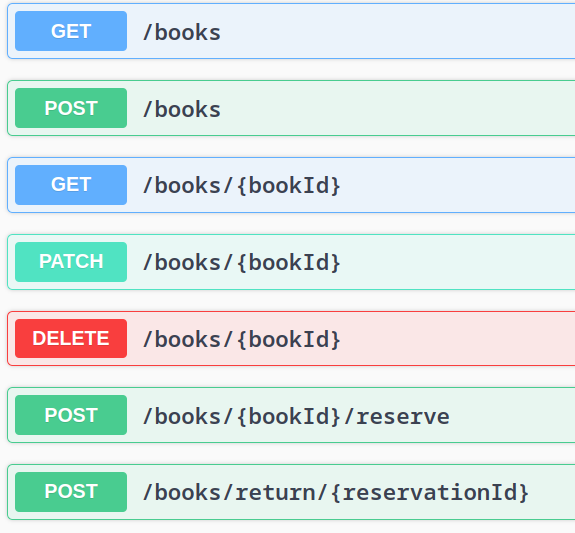

# Book Management API

Este repositório contém uma API para gerenciar um catálogo de livros, além de permitir a reserva, atualizando a quantidade em estoque. A API é implementada utilizando NestJS e usa PostgreSQL como banco de dados relacional. O Docker é utilizado para criar e gerenciar o ambiente de produção, garantindo uma configuração consistente e isolada.

### Testes Automatizados
Foram implementados testes unitários e de integração para garantir a qualidade do código. Os testes são executados automaticamente em cada commit, utilizando o GitHub Actions.

## Configuração do Ambiente

### Docker
É possível e recomendado que o projeto seja executado utilizando Docker Compose para iniciar um container de banco de dados PostgreSQL e outro container para a aplicação NestJS. Para isso, é necessário ter o Docker e o Docker Compose instalados.

Para iniciar o ambiente, execute o seguinte comando na raiz do projeto:
```bash
cd docker
docker-compose up --build -d
```

A aplicação estará disponível em `http://localhost:3000`, é possível acessar a documentação da API em `http://localhost:3000/api`.



É possível listar todos os livros, ou filtrá-los utilizando _query params_, como `author`, `title`, `publicationYear` ou `genre`. Exemplo: `https://localhost:3000/books?publicationYear=2021`.

É possível criar um novo livro, consultar detalhes de um livro, atualizá-lo, apagá-lo ou reservar uma unidade.

## Estrutura do Projeto
- `src/`: Código-fonte da aplicação NestJS.
- `docker/`: Arquivos de configuração do Docker.
- `test/`: Testes de integração.
- `Dockerfile`: Dockerfile para a aplicação NestJS.
